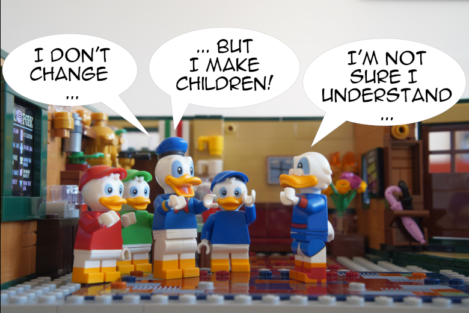

> [!NOTE] 译者注：
> 原文标题：
> [Should We Follow The Open-Closed Principle?](https://thevaluable.dev/open-closed-principle-revisited/)

> 开闭原则不改变行为，而是拓展行为

<!-- When I first heard about the SOLID principles as a young and innocent developer, many of them seemed confusing to me. The Open-Closed Principle looked easy, however: we should extend the behavior of our classes instead of modifying them. -->

当我还是个年轻而无知的菜鸟开发者的时候，第一次听说 S.O.L.I.D. 原则令我十分疑惑。其中的**开闭原则**（The *Open-Closed Principle*，**OCP**）看起来很简单：我们应该拓展类的行为，而不应该修改他们。

<!-- I did extend the behavior of my classes indeed! Mainly by [using inheritance](https://thevaluable.dev/guide-inheritance-oop/) in one form or another. The end result? An abstracted mess, where everybody was wondering what was the _use cases_ my code was covering, hidden under a cheer amount of abstractions and indirection. -->

我的确拓展了我的类的行为！主要通过 [继承](https://thevaluable.dev/guide-inheritance-oop/) 来实现。最后的结果呢？一坨抽象而混乱的代码，每个人都在想：我这一大堆抽象且间接的代码到底覆盖了什么样的*使用场景*。

<!-- What did I get wrong? Did I really understand the Open-Closed Principle? I still see many developers speaking about this concept in confusing ways, so let’s explore it in this article. More precisely, we’ll see: -->

是不是哪里搞错了？我真的理解开闭原则吗？我仍然看见很多开发者用一种容易令人混乱的方式提倡这个原则。所以，让我们一起在这篇博文中探讨一下吧。

具体来说，我们将会了解：

<!-- - What developers usually mean when they speak about the Open-Closed Principle. -->

- 在通常情况下，当开发者谈到 `开闭原则` 的时候，是什么意思

<!-- - The origins of the Open-Closed principle. -->
- 开闭原则的起源
<!-- - Robert Martin’s version of the Open-Closed Principle. -->
- Robert Martin 口中的开闭原则
<!-- - The Problems of the Open-Closed principle. -->
- 开闭原则的问题

<!-- To save my fingers from some painful typing, and because we all love acronyms in software development, I’ll use “OCP” for Open-Closed Principle in this article. -->

为了打字不那么累，也因为软件开发这一行很喜欢使用缩略语，接下来我会用“OCP”来代替开闭原则（**O**pen-**C**losed **P**rinciple）。

<!-- This is it: are you ready to be open and closed at the same time? I’m not, but let’s do it anyway. -->

你准备好在同一时刻保持既开又闭了吗？反正我还没有。不过无论如何，我们开始吧。

<!-- ## The Holy Definition -->

## 神圣的定义

<!-- When the OCP is brought up in enlightening conversations, everybody think of it as a part of the holy SOLID principles gathered by [Robert Martin](https://en.wikipedia.org/wiki/Robert_C._Martin). The SOLID acronym presumably gather useful “principles”, ideas which are “paraphrased” from influential authors or heavily inspired by some books or research papers. -->

当 OCP 在对话中被提起时，每个人都认为这是 [Robert Martin](https://en.wikipedia.org/wiki/Robert_C._Martin) 所总结的 SOLID 原则的一部分。SOLID 这个词大概总结了一些有用的“原则”，这些想法来自著名的作家，或者是受到了一些书籍、论文的深刻影响。

<!-- So, what’s the OCP? Martin first defined it when dinosaurs were ruling the Earth, in 1996: -->

所以，什么是 OCP 呢？Martin 早在恐龙还在统治地球的 1996 年，第一次给出了它的定义：

<!-- > Software entities (classes, modules, functions, etc.) should be open for extension, but closed for modification -->

> 软件实体（类，模块，函数等）应该对扩展开放，但对修改关闭。

<!-- Let’s imagine that your “software entity” is the class “Shipment”. Your project manager asks you to change the behavior of the shipments in your disruptive application. Should you modify the class? -->
让我们想象一下：你的“软件实体”是“Shipment”类。你的项目经理让你在混乱的业务中改变货物（shipment）的行为。你应该修改这个类吗？

<!-- Absolutely not! Your class should be close to modification. We don’t have the right to change it. But how can we ease the wrath of our project manager? We need to _extend_ our class! -->
绝对不要！你的类应该对修改关闭。我们没有权利修改它。那么我们该如何平息项目经理的怒火呢？我们需要*拓展*我们的类！

<!-- This is a weird idea. Have you ever seen a developer doing her job without modifying the code, only _adding_ to it? I didn’t. But it’s possible that I’ve only worked with pagans who didn’t know the Real Truth©. I worked with people trying to implement the OCP too, but they still had to modify some code at some point. -->
好吧，这个想法挺奇怪的。你这辈子见过一个开发者，工作的时候不修改代码，只*增加*代码的吗？我倒是没见过。但是可能是因为我只和那些不知道真相（Real Truth©）的异教徒合作过。我也和一群人一起尝试实现OCP，但是他们还是得在某些时候修改一些代码。

<!-- But let’s do some more research before digging the grave of our good old OCP. Where does this principle come from? -->
但是在我们挖开OCP的墓穴之前，先研究一下历史吧：这个原则从哪来的？

> [!NOTE]
> 就翻到这……后面等我鸽一鸽。

At the beginning of [Martin’s seminal article](https://drive.google.com/file/d/0BwhCYaYDn8EgN2M5MTkwM2EtNWFkZC00ZTI3LWFjZTUtNTFhZGZiYmUzODc1/view?resourcekey=0-FsS837CGML599A_o5D-nAw) about the OCP, it is said that its definition is a “paraphrase” of an older idea from Bertrand Meyers. He’s indeed the one who coined the terms “Open-Closed Principle” in his book [Object-Oriented Software Construction](https://www.goodreads.com/book/show/946106.oObject_Oriented_Software_Construction), written when some cells were beginning to clone themselves in vast oceans, in 1988.

So, let’s look at this book! A disclaimer though: I didn’t read it entirely (I couldn’t swallow the 1200 pages), but I had the courage and the resilience to read large chunks of it. Some old books about software development are still good nowadays, it’s not one of them.

The advice given here are generally bad. That said, it’s unfair to judge a 22 years old book with the actual standards, so let’s just say that it’s a product of its time.

Martin, even if he’s trying to “paraphrase” Meyer’s old idea, doesn’t get it right. Meyer doesn’t speak about “software entities”, he’s speaking only about classes:

> Classes should be the only modules.

Meyer is also the creator of the Eiffel programming language (1996). This was an important language, later influencing the design of Java and Objective-C. Eiffel was strongly object-oriented. You can clearly see it in the book, Meyer is a big fan of OOP and inheritance. In his own words:

> Classes will exchange information exclusively through feature calls, and through the inheritance mechanism.

He’s speaking about inheritance of implementation here. That’s not all: he’s also advocating for multiple inheritance, a practice which is very difficult to get right in practice:

> It should be possible for a class to inherit from as many others as necessary, with an adequate mechanism for disambiguating name clashes.

Why so much emphasis on inheritance? Why not using good old composition? The mantra “composition over inheritance” didn’t exist yet; it came in 1994 in the book [Design Pattern](https://www.goodreads.com/book/show/85009.Design_Patterns), years after the publication of Meyer’s book.

For Meyer, inheritance should be used as a polymorphism mechanism, to reuse code (one of the main concern of the book), and, of course, to respect the OCP. That’s the main reason why Meyer’s book didn’t age well: since then, we saw [the limits of traditional inheritance](https://thevaluable.dev/guide-inheritance-oop/) and the will from modern language to get away from it as much as possible, creating more focused constructs like interfaces or traits in the process.

Even if Martin says that he’s paraphrasing Meyer, their definitions of the OCP are different. It’s not only about the definition, it’s about _how_ to respect the “principle”.

## Robert Martin’s Open-Closed Principle

In his seminal article, Martin wrote that we should not _change_ existing code but always _adding_ code:

> When requirements change, you extend the behavior of such modules by adding new code, not by changing old code that already works.

He’s going very far in his argumentation, even saying that the “old” code should be “inviolate”. For him, to follow the OCP way of life, we should create [new abstractions](https://thevaluable.dev/abstraction-type-software-example/) instead of modifying new code. Concretely, he’s advocating, like Meyer, to use inheritance of implementation, but not only: we should also use abstract classes and interface constructs to respect the OCP.

In another article, Martin introduces the concept of “plugins architecture”:

> Plugin systems are the ultimate consummation, the apotheosis, of the Open-Closed Principle.

For him, many successful systems like “Vim, Emacs, Minecraft, or Eclipse” have this plugin systems, proof that the OCP is something we should all follow.

Great! So, what’s the problem then?

## The Problems of the Open-Closed Principle

Now that we saw the origins of OCP as well as Martin’s own definition, we’re finally ready to determine if the OCP is worth following.

### What About Refactoring?

Let’s address the elephant in the room: refactoring. To add a new functionality to an existing codebase, we often need to _modify_ the codebase itself, for two reasons:

1. For the new functionality to work with the old ones.
2. To keep the quality of the code high.

Now, instead of refactoring, let’s imagine that we create new abstractions each time. It means that we go around some deprecated behaviors by adding some code. In my world, it’s called a hack, the art of going around old code, letting it pollutes the codebase, and the mind of the poor developers. This is the Highway to Hell, the Path to Confusion, the Explosion of Line of Code. Don’t do this at home.

### Abstractions! Everywhere

Creating abstraction each time we want to modify our code bring other problems: it can create indirections and, as a result, [increase the complexity of the system](https://thevaluable.dev/kiss-principle-explained/). If we try to create each time a new “entity” (using Martin’s words) when we want to change one, we’ll see the cheer numbers of “entities” going through the roof.

If you look at the last example of [Martin’s article](https://drive.google.com/file/d/0BwhCYaYDn8EgN2M5MTkwM2EtNWFkZC00ZTI3LWFjZTUtNTFhZGZiYmUzODc1/view?resourcekey=0-FsS837CGML599A_o5D-nAw), the code is ridiculously complex for such a small functionality. New abstractions should only be created when we have _concrete reasons_ to use them, not each time we want to change our code.

### Martin’s Examples

The other examples Martin gives are pretty generic and, therefore, pretty bad. He’s speaking about `Shape`, `Circles`, and other classes which have nothing to do with the reality of software development. It’s easy to use any form of inheritance for concepts which don’t change. But when we work for some organizations, we have to deal with domain concepts linked to the messy and ever-changing world. A circle stays a circle, but what about a `Shipment` class? A `User`? As I [already wrote](https://thevaluable.dev/guide-inheritance-oop/), inheritance of implementation for domain concepts is generally a bad idea.

### Plugin Architecture

For Martin, as we saw above, the “plugin architecture” is the apotheosis of the OCP:

> What if the design of your systems was based around plugins, like Vim, Emacs, Minecraft, or Eclipse?

This is misleading. These systems can be extended with plugins not because the OCP is a good design principle, but because they want external developers to be able to extend the functionalities of their applications. These are two different goals.

The codebases themselves are often modified when new functionalities need to be added to the application. In short, they don’t respect the OCP. Just look at Vim’s codebase to be convinced.

### Martin’s Absolutism

“This is wrong!” claims Dave, your colleague developer. “This is a principle! It shouldn’t be always applied! It depends on the context!”

I’m glad that Dave brought this point. But it’s not how Martin explains it; as often, his opinion is quite absolute. The OCP is the way to go, and that’s all. When Martin addresses the relevance of the SOLID principles in one of his blog’s article, he’s defending the OCP vigorously:

> Of all the principles, the idea that anyone would question this one fills me full of dread for the future of our industry.

On the contrary: we should question what we do. We should thrive to understand the principles we use. We should understand if they’re good to use in a precise context. We should look at their potential benefits and trade-offs. We should listen to different opinions, to be sure ours are valid. We should look at every piece of information we find on the Internet (including this article) with a critical eye.

When should we use the OCP? Never. This is not a principle, it’s just a bad idea. You shouldn’t use abstractions like a magical remedy for everything which needs some change. If you do, you’ll take the risk to see your system collapses under the weight of its own complexity.

What should we do instead?

1. Thinking carefully before creating [abstractions](https://thevaluable.dev/abstraction-type-software-example/) and adding new layers of indirection.
2. Managing the relationships of the different elements composing our system, to make them [cohesive when we need to, decoupled otherwise](https://thevaluable.dev/single-responsibility-principle-revisited/), and to limit the propagation of changes.

Adding some sort of plugin system is a good idea if we want the users of our applications to be able to extend it. This has nothing to do with general architecture principles we should follow.

## Solid or Fluid?

The SOLID principles are appealing because they’re explained in simple and absolute terms. When I read Martin’s prose, it seems that they solve everything. But our designs shouldn’t be solid like a stone we can’t really shape for our own needs, but fluid and flexible depending on the ever-changing business domain we want to codify. In this context, the OCP can make everything SOLID indeed, creating abstractions which are hard to modify. We don’t want that.

What did we see in this article?

- The OCP was first coined by Bertrand Meyer. For him, we should use inheritance of implementation to respect it.
- Even if Martin claims that he’s paraphrasing Meyer, he’s not. For Martin, we can use any form of abstraction to respect it, on any “entity” (classes, functions, and whatnot).
- Adding new functionalities to a codebase implies changing the existing code (refactoring), not only adding new code.
- Adding layers of abstraction can add layers of indirection too, making the system more complex to understand and reason about.
- The “plugin architecture” is just a way to give the ability to users to extend their favorite application. This is not related to the OCP.

Like many, I saw Martin as a guide and mentor when I began my journey as a developer. I had to question my beliefs and to go in different communities to understand that these principles are not as good as they seem. It proves to me that we should be as open-minded as possible, and we should question the ideas of those who claim that they shouldn’t be questioned.
